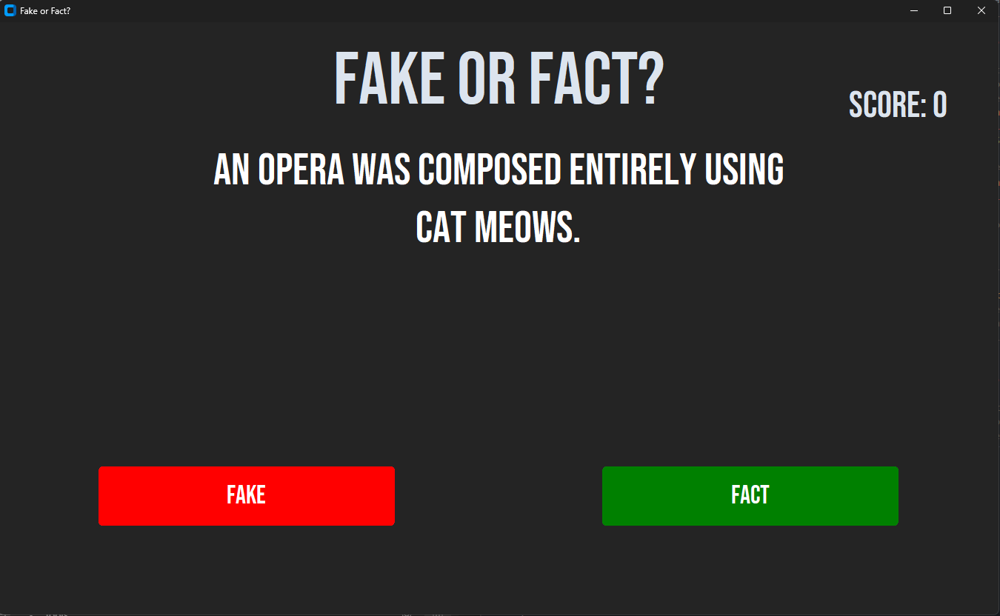

# ?Fake or Fact?

**Fake or Fact** is a interactive python quiz game build using customtkinter. The objective of this programme is to help people learn to seperate truthful statements from false statements.

---

## Features

 - Randomized Questions from a extensive list.
 - Modern GUI made using custom tkinter.
 - Active score tracking.
 - Unlimited replayability.
 - Clean and easy to understand code.

---

**Preview**

**

---

## Dependinces used

 - **Python 3.12**
 - **customtkinter** - for modern GUI creation
 - **tkinter** - base GUI framework
 - **random** - to change the news that is displayed
 - **os** - to handle importation of the font

 ---

 ## Installation

1.  **Clone the repository**
    - Go to CMD and input this 'git clone https://github.com/CadenCSC/Fake-or-Fact-.git'
    - This most likely would be found in 'C:\Users\yourname'

2. **Install the dependinces**
    - Run the file installrequirements.bat
    -This will install the required dependences to run the programme

3. **Run the programme as administrator**, this is due to it needing to use the OS dependence to import the font without the user needing to install the font.
          - You can run the python file as admininstrator by clicking on the empty space demonstrated in this image and typing CMD and clicking enter 
          - Next type 'Fake-or-fact.py' this should run the programme
   **OR**
   
    **Run the file using VSCode**
          - Right click the file, hover open with, then Visual Studio Code
          - Next click the play button 
   

